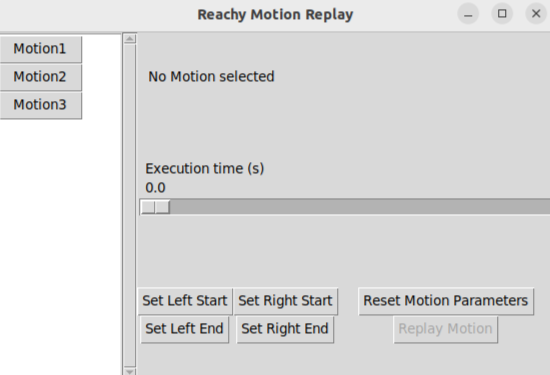

# Reachy Motion Training

This is an application designed to work with the Robot Reachy by Pollen Robotics and a modified version of its [Teleoperation application](https://github.com/M8TEN/ReachyTeleoperation). This code has been produced for my Bachelor Thesis.

## Dependencies
You will need to install the [Reachy-SDK](https://docs.pollen-robotics.com/developing-with-reachy-2/getting-started-sdk/installation/) for recording motions on the robot and the [Tkinter Module](https://docs.python.org/3/library/tkinter.html#module-tkinter) to play back the motions with the GUI. Alternatively, you can run [ReplayFromDMP.py](ReplayFromDMP.py) with changes to its main body to replay a motion without the interface.

## How it works
### Recording a motion
Clone this repository directly onto Reachy. To record motions, run [RecordingServer.py](RecordingServer.py) on Reachy and the [Teleoperation App](https://github.com/M8TEN/ReachyTeleoperation) on your VR-Headset. Once the VR-Headset is connected to the Server running on the Robot, press the secondary button on the left controller to start the recording and press it again to save the recording. When recording, a red circle indicator will show in the top-left corner of your screen. An red circle with a dash trough it will appear when recording is currently not possible or while the last recording is being saved.

### Playing a motion back

To play back any recorded motions, open [ReplayInterface.py](ReplayInterface.py).
Select the motion from the list on the left. This will load the default motion parameters. Pressing "Replay Motion" will then replay the motion as it was recorded. You can change how long the motion will take with the "Execution time" slider. Setting new start and end positions for the right and left hands of Reachy requires you to hold the arm in the position you want it to start or end and pressing the corresponding button in the bottom-left corner while the robot holds the pose. Pressing "Reset Motion Parameters" will set the motion parameters back to their default values.

## Limitations
Due to time constraints in the original project, basic safetly volumes have been defined in the code that prevent Reachy's arms from leaving them. This is so that Reachy won't hit itself or others when trying to reproduce the recorded motion. If these volumes feel to restrictive, you can modify the values for them in [ReplayFromDMP.py](ReplayFromDMP.py).